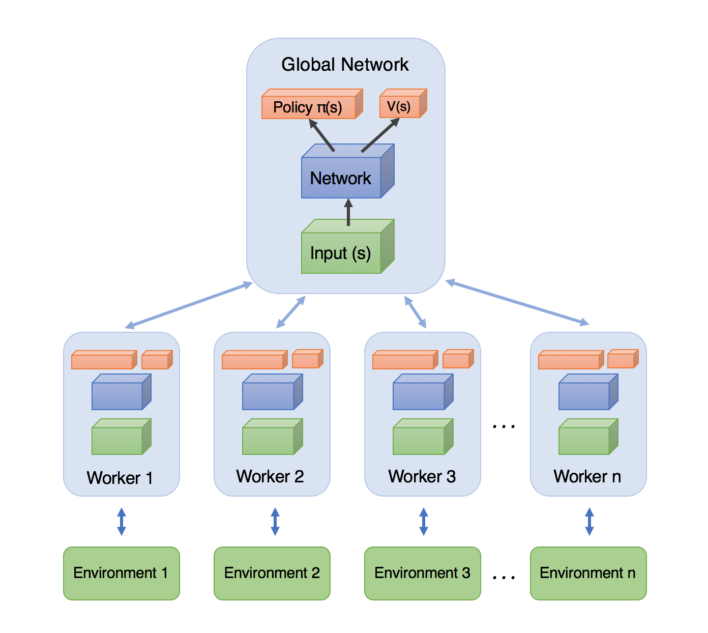

# A3C - Asynchronous Advantage Actor-Critic 


[Image source](https://medium.com/emergent-future/simple-reinforcement-learning-with-tensorflow-part-8-asynchronous-actor-critic-agents-a3c-c88f72a5e9f2)

This is our implementation of A3C and the corresponding synchronous version A2C based on the paper [Asynchronous Methods for Deep Reinforcement Learning](https://arxiv.org/abs/1602.01783) from Mnih, et al.
We also combined this with [General Advantage Estimation](https://arxiv.org/abs/1506.02438) as it has shown improved performance for policy gradient methods.   

## Code structure
- [models](models): Neural network models for actor and critic.  
- [optimizers](optimizers): Optimizers with shared statistics for A3C.  
- [util](./util): Helper methods to make main code more readable.


## Executing experiments
1) Activate the anaconda environment
```bash
source activate my_env
```
2) Execute the [a3c_runner](../a3c_runner.py) script (the default environment is CartpoleStabShort-v0)

Training run from scratch:
```bash
python3 my/path/to/a3c_runner.py
```

Training run from an existing policy:
```bash
python3 my/path/to/a3c_runner.py --path my_model_path
```
e.g. load pretrained models in test mode:

### CartpoleStabShort-v0 (500Hz)
```bash
python3 a3c_runner.py --env-name CartpoleStabShort-v0 --max-action 5 --test --path experiments/best_models/a3c/stabilization/simulation/model_split_T-53420290_global-7597.67863_test-9999.97380.pth.tar
```

### CartpoleSwingShort-v0 (500Hz)
```bash
python3 a3c_runner.py --env-name CartpoleSwingShort-v0 --max-action 10 --test --path experiments/best_models/a3c/swing_up/model_split_T-13881240_global-4532.753498284313_test-19520.67601316739.pth.tar
```

### Qube-v0 (500Hz)
```bash
python3 a3c_runner.py --env-name Qube-v0 --max-action 5 --test --path experiments/best_models/a3c/qube/model_split_T-164122000_global-3.66047_test-5.51714.pth.tar
```

More console arguments (e.g. hyperparameter changes) can be added to the run, for details see
```bash
python3 my/path/to/a3c_runner.py --help
```

3) (Optional) Start tensorboard to monitor training progress
```bash
tensorboard --logdir=./experiments/runs 
```

## Executing evaluation run for existing policy
1) Activate the anaconda environment
```bash
source activate my_env
```

2) Execute the [a3c_runner](../a3c_runner.py) script
```bash
python3 my/path/to/a3c_runner.py --path my_model_path --test
```
